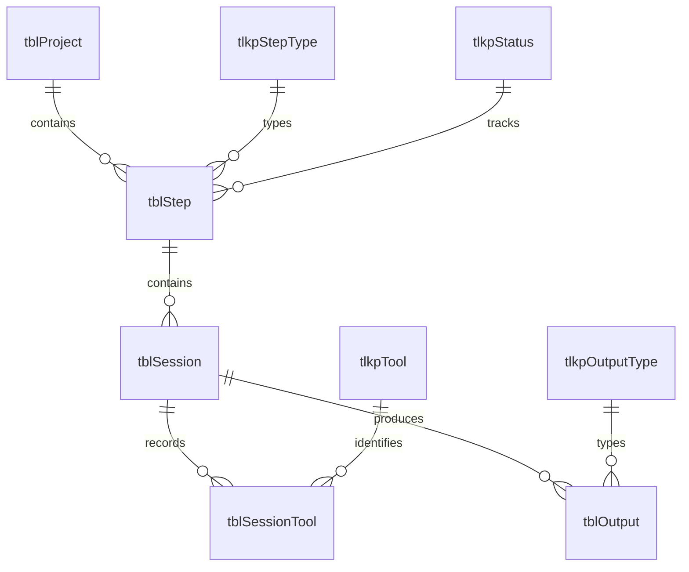

# DevPulse — Architecture

DevPulse is a Microsoft Access application with two front-end editions and a choice of backends. This document covers the decisions that shaped its structure — the data model, the backend split, the version control approach, and the toolchain. For the development methodology and workflow, see [CLAUDE.md](CLAUDE.md).

## Data Model

The core of DevPulse is a three-level tracking hierarchy: a **Project** contains **Steps**; each Step has one or more **Sessions**; each Session records the **Tools** used and the **Outputs** produced. Every revision cycle, context reset, and time measurement lives at the Session level.

Five lookup tables (StepType, Status, Tool, OutputType, ProjectArea) carry the controlled vocabulary. `tblAppConfig` holds application-level settings. The schema is identical across both backends.

## Backend Editions

DevPulse ships two front ends paired with different backends:

| Edition                      | Backend       | Connection         | First run               |
| ---------------------------- | ------------- | ------------------ | ----------------------- |
| **SSE** (SQL Server Express) | SQL Server    | ODBC linked tables | Credential setup dialog |
| **ACE** (Access BE)          | Access .accdb | DAO linked tables  | Automatic               |

The SQL Server edition is the primary offering — it supports distributed access and is forward-compatible with team deployments. The Access BE edition is self-contained: download two files, open one, start recording.

Both editions share the same VBA front-end codebase, the same ribbon, the same forms, and the same sample data. The connection layer is the only structural difference.

## Version Control

Version control is central to AI-assisted development — more so than in traditional solo work, not less.

**The commit is the acceptance gate.** The AI writes; the human tests; the human commits. Nothing enters the repository until a human has reviewed and accepted it. That discipline matters more, not less, when the author of the code is not the person doing the review.

**Context resets demand a ground truth.** When a conversation window fills and the AI resumes fresh, the git log is the authoritative record of what was actually built and accepted — not what was discussed or proposed.

**Diff is how you audit AI output.** Access `.accdb` files are binary. The VCS source export (`DevPulseSSE.accdb.src/`, `access_ace/`) creates a human-readable text representation of every module, form, query, and table definition. Without it, there is no way to inspect what changed between sessions.

The VCS export creates text representations of Access objects that can be reimported to reconstruct a working `.accdb` — but editing them directly demands precise knowledge of the format and no safety net. The MCP bridge operates against the live `.accdb` via COM, providing immediate feedback and making AI-driven manipulation of Access objects practical at scale. That is why source files in this repository are exports, not inputs.

## Toolchain

| Tool                  | Role                                                                                           |
| --------------------- | ---------------------------------------------------------------------------------------------- |
| Claude Code           | Wrote all VBA, SQL, and Access structure — every object in this repository                     |
| Access Explorer MCP   | COM-driven `.accdb` manipulation from within Claude Code; Access is open and visible but operated programmatically |
| SQL MCP               | Direct SQL Server queries during development and data verification                             |
| PowerShell            | File operations, SQL script execution, git operations, distro assembly                         |
| Microsoft Access      | Testing — every task verified in the live application before the session closed                |
